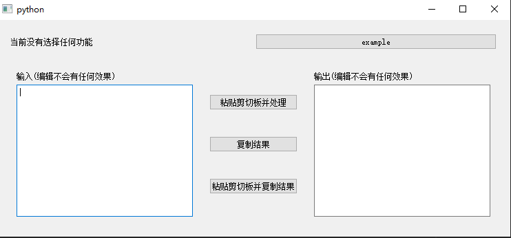

# TextConverter
作者: Gray-Ice 

项目描述: **容易添加功能**的文本转换器。
示例:


## 如何自定义功能按钮
本工具需要你手动在utils/buttons.py添加一些功能，例如:
```python
# 数据类型MenuButtonType
MenuButtonType = TypedDict("MenuButtonType", {
    "name": str,
    "behavior": Callable[[str], str]
})

def example(text)->str:
    return "This is an example."


# 在此处添加你定义的功能按钮，name是按钮的名称，behavior是点击按钮后会调用的函数，类型为(str)->str
buttons: List[MenuButtonType] = [
    {"name":"example", "behavior": example},
]
```
在你向buttons中添加了一个MenuButtonType类型的字典后, 当你启动程序时该按钮将会加入到功能按钮列表。

## 如何使用本工具
先选择功能按钮，然后选择粘贴剪切板并处理